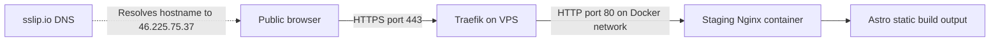
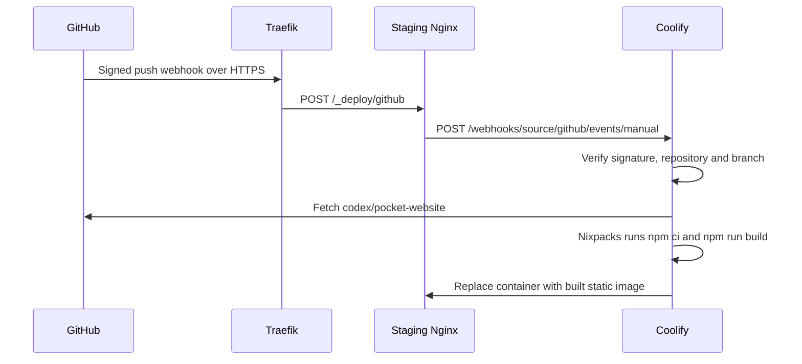

# Staging architecture

See [Coolify staging](coolify-staging.md) for identifiers, build settings, and operating instructions.

## Public website traffic



The hostname `heartbit-staging.46.225.75.37.sslip.io` resolves to the IPv4 address embedded in its name. No Heartbit DNS zone configuration is involved, and no AAAA record was added. The hostname depends on the VPS retaining that address and on the external sslip.io DNS service.

The existing Coolify-managed Traefik proxy listens on the VPS's public HTTP/HTTPS ports. It selects the staging application by hostname, handles HTTP-to-HTTPS redirection, terminates TLS, and manages the Let's Encrypt certificate through an HTTP challenge. The application-specific noindex setting adds the response header at this layer.

Nginx serves the generated `/dist` contents from `/usr/share/nginx/html` on container port 80. That port is reached through the Docker network; it is not separately published as a public application port. Ordinary pages resolve to their generated HTML files. Missing routes retain status 404 and use Astro's `404.html`.

## Push-to-deploy flow



The staging application's **Custom Nginx Configuration** contains the following route in its `server` block:

```nginx
location = /_deploy/github {
    limit_except POST { deny all; }
    client_max_body_size 25m;
    proxy_pass http://coolify:8080/webhooks/source/github/events/manual;
    proxy_set_header Host localhost;
    proxy_set_header Authorization "";
    proxy_set_header Cookie "";
    proxy_set_header X-Forwarded-Proto https;
    proxy_set_header X-Forwarded-For $remote_addr;
    proxy_connect_timeout 5s;
    proxy_read_timeout 60s;
}
```

This is an excerpt, not a replacement for the full static-server configuration. Both containers use the `coolify` Docker network, where `coolify:8080` reaches the internal webhook handler. Nginx preserves the request body and GitHub signature headers for verification. Only the exact webhook path is proxied; this does not publish the dashboard or general Coolify API.

Webhook ingress depends on the staging container being available. If that container is stopped or cannot serve the route, GitHub delivery fails. Restore it through Coolify, then redeliver a failed webhook from GitHub or deploy the desired branch commit manually. No separate webhook-relay service is installed.

## Administration and ownership

| Component                                             | Configuration owner                               |
| ----------------------------------------------------- | ------------------------------------------------- |
| Application, branch, build commands, environment      | Coolify application                               |
| Static routing and exact webhook forwarding           | Coolify Custom Nginx Configuration                |
| HTTPS routing, certificate management, noindex header | Coolify-managed Traefik configuration             |
| Code, lockfile, Node pin, check workflow              | GitHub repository                                 |
| Push subscription and matching webhook secret         | GitHub repository webhook and Coolify application |
| Generated hostname resolution                         | External sslip.io service                         |
| Private dashboard access                              | Existing Tailscale Serve configuration            |
| Production site                                       | Existing GitHub Pages configuration               |

The dashboard is proxied through Tailscale to Coolify's loopback-bound port 8000. Staging visitors and GitHub webhook deliveries use the public Traefik route and do not need Tailscale. API administration uses Coolify authentication; tokens and private keys belong in supported credential storage, never in documentation.

Production traffic goes to GitHub Pages and does not traverse this staging application. No unrelated VPS application or global proxy configuration was changed for staging.
